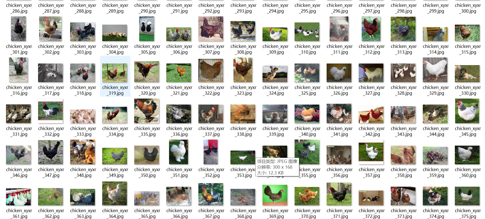
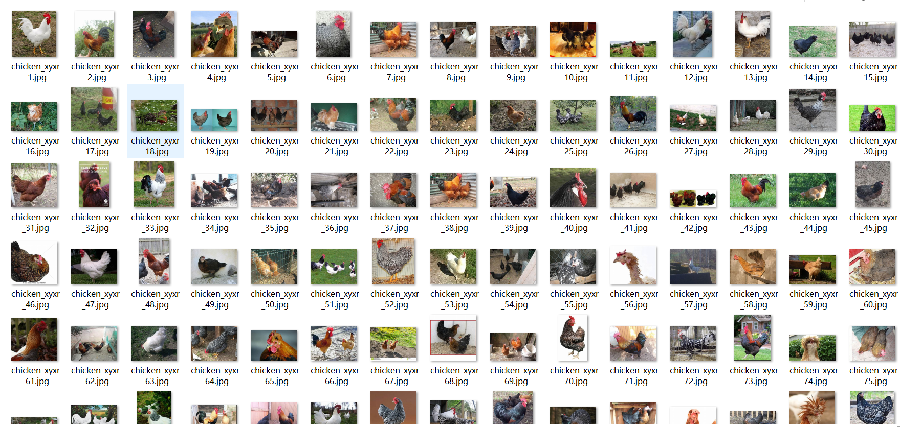

# [Object Detection] Poultry Chicken Small Chicken Detection Dataset 2970 imagesVOC+YOLO format-Hand Work Annotation

Dataset Description: ~

【Target Detection Dataset】Poultry Chicken Detection Dataset 2970 Images in VOC+YOLO format - Manually labeled.zip

Mainly marked as (hen, rooster, chick)

Dataset format: Pascal VOC format + YOLO format (the txt file does not contain the split path, it only contains jpg images and corresponding VOC format xml files and yolo format txt files)

Number of images (total jpg file count): 2971

Number of xml files: 2971

Number of txt files: 2971

Number of categories: 1

Annotation class names: ["chicken"]

Number of boxes labeled in each category:

chicken frame count = 6358

Total boxes: 6358

Use the labeling tool: labelImg

## Images

---

Here is a pay link on Stripe (https://buy.stripe.com/3cs8yP7sY87d0vu9AB). Please contact me lonlonago@foxmail.com after funding $89, and I will send you a complete data files, thank you!

